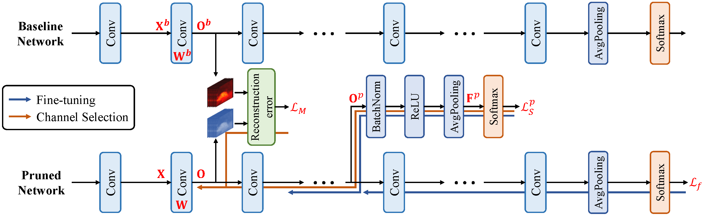
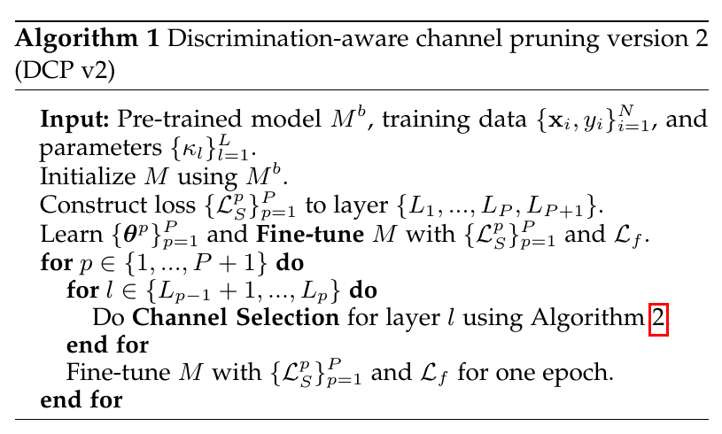
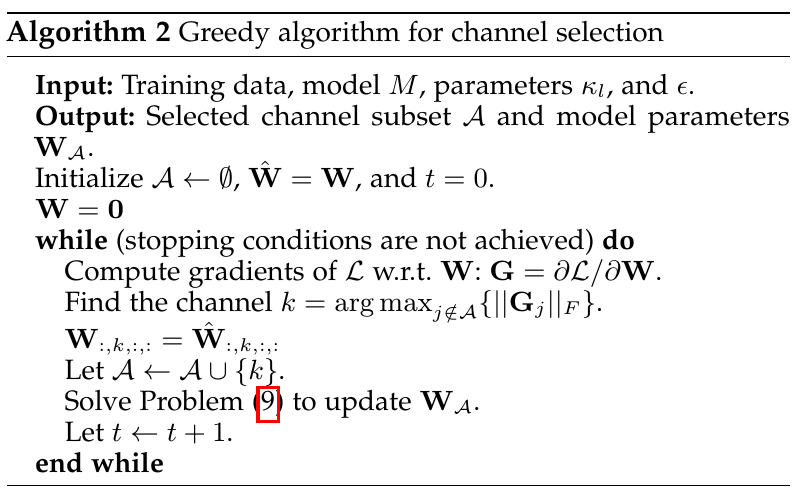

# Discrimination-aware Channel Pruning for Deep Neural Networks （NeurIPS 2018)

[](https://opensource.org/licenses/BSD-3-Clause)

## Architecture of Discrimination-aware Channel Pruning (DCP)



## Training Algorithm




## Recent Update

**`2019.05.10`**: We release a new version of dcp.

**`2018.11.27`**: We release the source code of dcp.

## Requirements

* python 2.7
* pytorch 0.4
* tensorflow
* pyhocon
* prettytable

## Testing

1. Download the pre-trained pruned model from the [model zoo](https://github.com/SCUT-AILab/DCP/wiki/Model-Zoo).

2. Add DCP into PYTHONPATH.
```Shell
# This is my path of DCP. You need to change to your path of DCP.
export PYTHONPATH=/home/liujing/Codes/Discrimination-aware-Channel-Pruning-for-Deep-Neural-Networks:$PYTHONPATH
```

3. Set configuration for testing.
You need to set `save_path`, `data_path`, `dataset`, `pruning_rate`, `net_type`, `depth` and the `pretrained` in `dcp/test/test.hocon`.

```Shell
cd dcp/test/
vim test.hocon
```

4. Run testing.
```Shell
python main.py test.hocon
```

## Channel Pruning Examples

1. Download pre-trained mdoel.
* [resnet-56 BaiduDrive](https://pan.baidu.com/s/1HFXzHNHFDa57RlVk2W71Aw), [resnet-56 GoogleDrive](https://drive.google.com/open?id=1nCIqcSkFdErtmgNUfwW2RDN6EUlFfTfa).

2. Add DCP into PYTHONPATH.
```Shell
# This is my path of DCP. You need to change to your path of DCP.
export PYTHONPATH=/home/liujing/Codes/Discrimination-aware-Channel-Pruning-for-Deep-Neural-Networks:$PYTHONPATH
```

3. Before channel pruning, you need to add discrimination-aware loss and fine tune the whole network. You need to set `save_path`, `data_path`, `experiment_id` and the `pretrained` in `dcp/auxnet/cifar10_resnet.hocon`.
```Shell
cd dcp/auxnet/
vim cifar10_resnet.hocon
```

4. Add discrimination-aware loss and conduct fine-tuning.
```Shell
python main.py cifar10_resnet.hocon
```

5. Set configuration for channel selection. You need to set `save_path`, `data_path`, `pruning_rate` and `experiment_id` in `dcp/channel_selection/cifar10_resnet.hocon`. Additionally, you need to set `pretrained` to the path of `best_model_with_aux_fc.pth` in `check_point` folder.
```Shell
cd dcp/channel_selection/
vim cifar10_resnet.hocon
```

6. Conduct channel selection.
```Shell
python main.py cifar10_resnet.hocon
```

7. Set configuration for fine-tuning. You need to set `save_path`, `data_path`, and `experiment_id` in `dcp/finetune/cifar10_resnet.hocon`. Additionally, you need to set `pretrained` to the path of `model_xxx_cs_000.pth` in `check_point` folder.
```Shell
cd dcp/finetune/
vim cifar10_resnet.hocon
```

8. Fine-tune the pruned model.
```Shell
python main cifar10_resnet.hocon
```

## Citation
If you find *DCP* useful in your research, please consider to cite the following related papers:
```
@incollection{NIPS2018_7367,
title = {Discrimination-aware Channel Pruning for Deep Neural Networks},
author = {Zhuang, Zhuangwei and Tan, Mingkui and Zhuang, Bohan and Liu, Jing and Guo, Yong and Wu, Qingyao and Huang, Junzhou and Zhu, Jinhui},
booktitle = {Advances in Neural Information Processing Systems 31},
editor = {S. Bengio and H. Wallach and H. Larochelle and K. Grauman and N. Cesa-Bianchi and R. Garnett},
pages = {881--892},
year = {2018},
publisher = {Curran Associates, Inc.},
url = {http://papers.nips.cc/paper/7367-discrimination-aware-channel-pruning-for-deep-neural-networks.pdf}
}

```